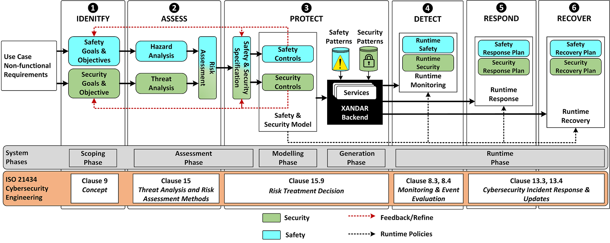

# X-by-Construction Design Framework for Engineering Autonomous & Distributed Real-time Embedded Software Systems (XANDAR)
Project Website: https://xandar-project.eu/

## Research Problem
The introduction of ["Smart Mobility"](https://www2.deloitte.com/content/dam/insights/us/articles/smart-mobility-trends/DUP_1027_Smart-Mobility_MASTER1.pdf) within the broader concept of Smart City infrastructure offers a great potential to make our automotive and avionic transport systems reliable, efficient, and safer. Smart Mobility technologies rely on scene understanding, planning and decision-making processes [[1]](#1). These processes are heavily dependent on the input data coming from multiple sources. This data can be adversely manipulated or maliciously modified while propagating across the autonomous driving data processing pipeline, leading to an unexpected and hazardous situation. Furthermore, ensuring safety of such system including dense urban space systems have become a complex and challenging task, due to adoption of autonomous technologies.

## Research Approach
To tackle this research problem, XANDAR proposes an X-by-Construction (XbC) approach [[2]](#2). This approach advocates the adoption of a risk-oriented safety and security process to scope, identify, analyse, and assess the risks and hazards to the system [[3]](#3). This process-driven approach provides foundation to systematically architect a multi-layered system safety and security architecture. It will be achieved by deploying different defences across the system, allowing protection, detection, response, and recovery functions [[3]](#3) as shown in Figure. Thus, making the system more resilient against latent vulnerabilities and outsider attacks.

## Pattern based Security

A security pattern is described as:

> "A solution to the problem of mitigating a set of specific threats by deploying a security control defined in a given context"

The basic aim of security is to isolate or restrict actors (the humans or automated processes) that are the active entities in the systems, from having unrestricted access to the resources of the system. The benefit of using the security pattern approach is to facilitate application and software developers (who are not security experts) to enhance security in their designs [[2]](#2). Though to effectively use patterns, it is critical that the use of each pattern, its applicability and context shall be explicitly specified to its user. It is important to specify that a security pattern is directly related to a threat rather than to a vulnerability. For instance, the specific threat may be the result of one or more vulnerabilities, but the security pattern is intended to mitigate the threat, rather than resolve the vulnerability.

In the scope of XANDAR, a security pattern facilitates the process of selecting appropriate risk mitigation strategy, during the concept phase, and deployment of system-level defences (during generation and runtime phase) across the systems (as shown in Figure) to enhance security and improve resilience of a safety-critical embedded system.

## References
[1] F. Siddiqui, R. Khan and S. Sezer, "Bird's-eye view on the Automotive Cybersecurity Landscape & Challenges in adopting AI/ML," 2021 Sixth International Conference on Fog and Mobile Edge Computing (FMEC), 2021, pp. 1-6.

[2] L. Masing et al., "XANDAR: Exploiting the X-by-Construction Paradigm in Model-based Development of Safety-critical Systems," 2022 Design, Automation & Test in Europe Conference & Exhibition (DATE), 2022, pp. 1-5.

[3] F. Siddiqui et al., "XANDAR: A holistic Cybersecurity Engineering Process for Safety-critical and Cyber-physical Systems," 2022 IEEE 95th Vehicular Technology Conference: (VTC2022-Spring), 2022, pp. 1-5.
